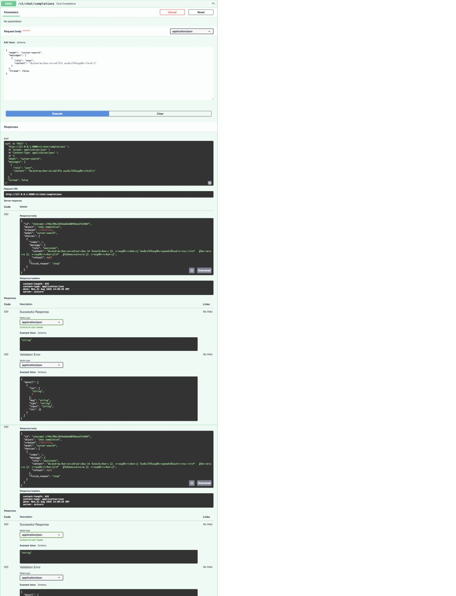
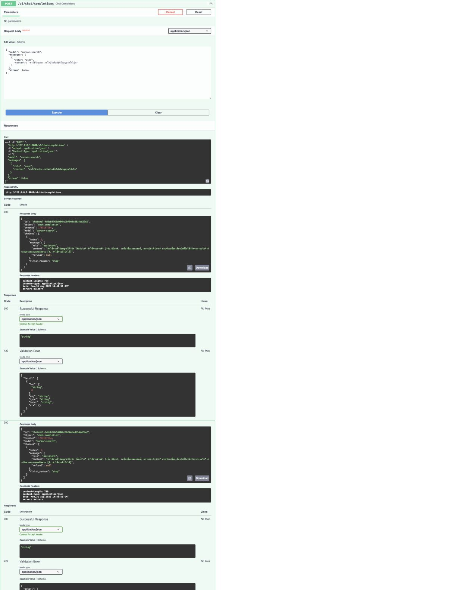

# Travel Policy Agents

ระบบตอบคำถามนโยบายการเดินทางต่างประเทศด้วย LangGraph บน Python

## Architecture

`START → retrieve → format → END`

- node `retrieve` ค้นหา section ที่เกี่ยวข้องจาก `knowledge_base.txt` ด้วย embeddings แล้วสร้างคำตอบที่อ้างอิงหลักฐาน
- node `format` ทำให้คำตอบอ่านง่าย โดยห้ามเพิ่มข้อเท็จจริงนอกเหนือจากผลค้นหา
- edge ถูกกำหนดตายตัว: `retrieve` ต้องเสร็จก่อน `format` เสมอ
- RAG index อยู่ใน memory: เหมาะกับไฟล์นโยบายขนาดเล็ก และไม่มีบริการฐานข้อมูลเพิ่ม

## Setup

1. ใช้ Python 3.11 ขึ้นไป
2. ติดตั้งแพ็กเกจ: `uv sync --extra dev`
3. คัดลอกไฟล์: `cp .env.example .env`
4. กรอก `TRAVEL_POLICY_LLM_API_KEY` และปรับ `TRAVEL_POLICY_LLM_BASE_URL` หากใช้ OpenAI-compatible endpoint

## Run the API

```bash
uv run python main.py
```

ส่งคำถามไปที่ `POST /v1/chat/completions`:

```bash
curl http://127.0.0.1:8000/v1/chat/completions \
  -H "Content-Type: application/json" \
  -d '{
    "model": "cursor-search",
    "messages": [{"role": "user", "content": "เที่ยวบินเกิน 6 ชั่วโมงเลือกชั้นโดยสารอะไรได้บ้าง"}]
  }'
```

หากตั้ง `TRAVEL_POLICY_APP_API_KEY` ให้ส่ง `Authorization: Bearer <TRAVEL_POLICY_APP_API_KEY>` เพิ่มด้วย. Endpoint นี้รองรับข้อความแบบ non-streaming และใช้ user message ล่าสุดเป็นคำถามของ RAG

## Swagger Verification

การทดสอบนี้ยืนยันว่า API รับคำถามผ่าน OpenAI-compatible Chat Completions และตอบโดยใช้ `knowledge_base.txt` เท่านั้น แต่ละคำตอบต้องมีชื่อ section ในวงเล็บเหลี่ยมเพื่อระบุแหล่งข้อมูล

วิธีทดสอบ:

1. รัน `uv run python main.py`
2. เปิด `http://127.0.0.1:8000/docs`
3. ขยาย `POST /v1/chat/completions` แล้วเลือก **Try it out**
4. ส่ง `model: cursor-search` พร้อม user message จากตัวอย่างด้านล่าง

ผลการทดสอบจริง:

| คำถาม | ผลลัพธ์ | แหล่งข้อมูล |
| --- | --- | --- |
| ต้องส่งคำขอเดินทางล่วงหน้ากี่วัน และต้องได้รับอนุมัติจากใครบ้าง | อย่างน้อย 14 วัน ผ่าน Travel Portal และต้องได้รับอนุมัติจากผู้จัดการสายงานกับผู้รับผิดชอบงบประมาณ | `[2. การอนุมัติการเดินทาง]` |
| ค่าใช้จ่ายประเภทใดบ้างที่บริษัทไม่อนุญาตให้เบิก | ค่าใช้จ่ายส่วนตัว มินิบาร์ แอลกอฮอล์ ความบันเทิง ค่าปรับเปลี่ยนเที่ยวบินที่ไม่เกิดจากงาน และค่าเดินทางของผู้ติดตาม | `[4. ค่าใช้จ่ายที่เบิกได้]` |
| หลังกลับถึงประเทศไทย ต้องส่งรายงานค่าใช้จ่ายภายในกี่วันและต้องแนบอะไรบ้าง | ภายใน 10 วันทำการ พร้อมใบเสร็จและหลักฐานชำระเงิน; รายการไม่มีใบเสร็จต้องมีคำชี้แจงและผู้จัดการอนุมัติ | `[6. การเบิกจ่ายหลังเดินทาง]` |

### 1. การอนุมัติการเดินทาง



### 2. ค่าใช้จ่ายที่เบิกไม่ได้



### 3. การส่งรายงานค่าใช้จ่าย


## Verify

```bash
uv run pytest
uv run ruff check .
```

`knowledge_base.txt` คือแหล่งข้อมูลเดียวของคำตอบ โดยแต่ละหัวข้อต้องขึ้นต้นด้วยรูปแบบ `1. ชื่อหัวข้อ`.
